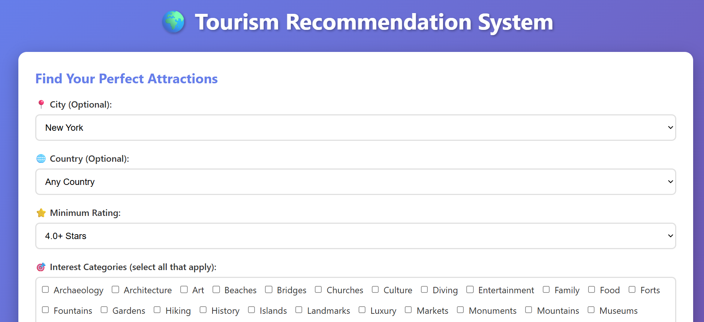
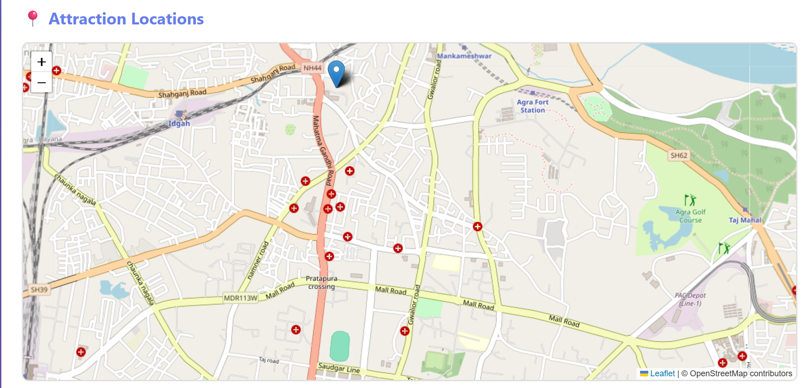
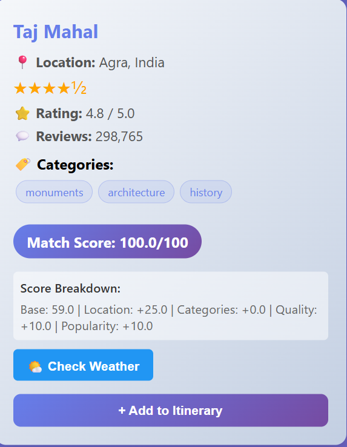
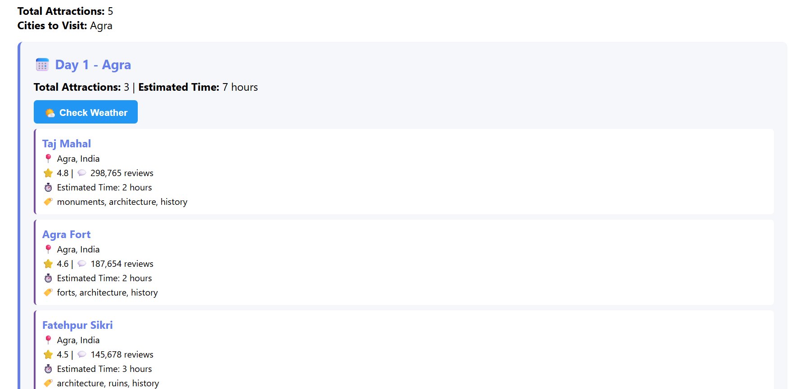

markdown# 🌍 Tourism Recommendation System

An intelligent tourism recommendation platform that helps travelers discover and plan their perfect trip using AI-powered recommendations, interactive maps, and smart itinerary optimization.


**Live Demo:**  
https://tourism-recommendation-system-pp11.onrender.com

---

## 📋 Table of Contents

- [Overview](#-overview)
- [Features](#-features)
- [Tech Stack](#-tech-stack)
- [Architecture](#-architecture)
- [Installation](#-installation)
- [Usage](#-usage)
- [API Documentation](#-api-documentation)
- [Project Structure](#-project-structure)
- [Recommendation Algorithm](#-recommendation-algorithm)
- [Deployment](#-deployment)
- [Contributing](#-contributing)
- [License](#-license)
- [Contact](#-contact)

---

## 📌 Overview

The Tourism Recommendation System is a full-stack web application that leverages data-driven algorithms to provide personalized travel recommendations. Built with Flask and vanilla JavaScript, it combines intelligent scoring mechanisms with an intuitive user interface to help travelers discover attractions and plan multi-day itineraries efficiently.

**Key Highlights:**
- 🎯 Smart recommendation engine with configurable scoring weights
- 🗺️ Interactive map visualization with real-time highlighting
- 📅 Multi-day itinerary optimization
- 🌙 Beautiful dark mode support
- 💾 Persistent user preferences and selections
- 📱 Fully responsive design

---

## ✨ Features

### 🎯 Smart Recommendations
- **AI-Powered Scoring**: Configurable weighted algorithm combining rating, popularity, location, and category matching
- **Diversity Penalty**: Prevents redundant suggestions (e.g., showing 10 museums in a row)
- **Personalized Matching**: Scores attractions based on user preferences and interests
- **Score Transparency**: Detailed breakdown showing how each recommendation score is calculated

### 🗺️ Interactive Map View
- **Live Location Mapping**: Automatically geocodes and plots attractions on interactive Leaflet maps
- **Smart Clustering**: Groups attractions by city for better visualization
- **Selection Highlighting**: Selected itinerary items are highlighted with animated markers showing count
- **Detailed Popups**: Click markers to see attraction lists with ratings and selection status
- **Auto-Zoom**: Automatically fits map bounds to show all attractions

### 📅 Intelligent Itinerary Optimization
- **Multi-Day Planning**: Distribute attractions across customizable trip duration
- **City Grouping**: Organizes attractions by city to minimize travel time
- **Time Estimation**: Calculates visit duration based on attraction type (museums: 3hrs, beaches: 2hrs, etc.)
- **Balanced Scheduling**: Aims for 6-8 hours of activities per day
- **Day Summary**: Shows total hours and number of attractions per day

### 🎨 User Experience
- **🌙 Dark Mode**: Beautiful dark theme with smooth CSS transitions and persistent preference
- **💾 Smart Persistence**: Preferences and selections auto-save to localStorage
- **📱 Responsive Design**: Works seamlessly on desktop, tablet, and mobile devices
- **🔗 Direct Links**: Wikipedia/info links for every attraction to learn more
- **🧹 Easy Reset**: 
  - Clear All Filters: Resets everything to defaults
  - Clear Selections Only: Keeps preferences, removes itinerary selections

### 🔍 Advanced Filtering
- **Location-Based**: Filter by country and city (cascading dropdowns coming soon)
- **Quality Control**: Minimum rating threshold (3.0 - 4.5 stars)
- **Category Selection**: Choose from 10+ attraction types:
  - Museums
  - Parks
  - Historical Sites
  - Religious Sites
  - Entertainment
  - Architecture
  - Nature
  - Shopping
- **Result Limits**: Control number of recommendations (1-20)

---

## 🛠️ Tech Stack

### Backend
- **Python 3.11** - Core programming language
- **Flask 3.0** - Lightweight web framework
- **Pandas 2.2.3** - Data processing and manipulation
- **Flask-Caching 2.1.0** - Performance optimization
- **Requests 2.31.0** - HTTP client for external APIs
- **Gunicorn 21.2.0** - Production WSGI server

### Frontend
- **HTML5** - Semantic markup
- **CSS3** - Modern styling with CSS Variables for theming
- **Vanilla JavaScript (ES6+)** - No frameworks, pure JS
- **Leaflet.js 1.9.4** - Interactive map library

### External APIs
- **Nominatim (OpenStreetMap)** - Geocoding service for city coordinates
- **OpenStreetMap** - Map tiles and geographic data
- **Wikipedia** - Attraction information links

### Infrastructure
- **Hosting**: Render.com (Free Tier)
- **Version Control**: Git/GitHub
- **Python Runtime**: 3.11.9

---

## 🏗️ Architecture

### System Design
```
┌─────────────────────────┐
│    User Browser         │
│  (HTML/CSS/JS + Map)    │
└───────────┬─────────────┘
            │ HTTP/JSON
            ▼
┌─────────────────────────┐
│   Flask Application     │
│  ┌──────────────────┐   │
│  │ Route Handlers   │   │
│  ├──────────────────┤   │
│  │ Caching Layer    │   │
│  ├──────────────────┤   │
│  │ Business Logic   │   │
│  │ - Recommender    │   │
│  │ - Scoring        │   │
│  │ - Itinerary      │   │
│  └──────────────────┘   │
└───────────┬─────────────┘
            │
    ┌───────┴────────┐
    ▼                ▼
┌─────────┐    ┌──────────────┐
│   CSV   │    │ External APIs│
│ Dataset │    │ - Nominatim  │
└─────────┘    └──────────────┘
```

### Request Flow
```
User Action
    ↓
Frontend Validation
    ↓
AJAX Request to Flask API
    ↓
Flask Route Handler
    ↓
Cache Check (if enabled)
    ↓
Data Processing (Pandas)
    ↓
Recommendation Engine
    ├── Filter by preferences
    ├── Calculate scores
    ├── Apply diversity penalty
    └── Sort & limit results
    ↓
JSON Response
    ↓
Frontend Rendering
    ├── Display cards
    ├── Update map
    └── Save to localStorage
```

---

## 📦 Installation

### Prerequisites
- Python 3.11 or higher
- pip package manager
- Git (optional, for cloning)

### Local Development Setup

1. **Clone the repository**
```bash
git clone https://github.com/5h-am/Tourism_Recommendation_System.git
cd Tourism_Recommendation_System
```

2. **Create virtual environment**

**Using venv (recommended):**
```bash
python -m venv venv

# Activate on Linux/macOS:
source venv/bin/activate

# Activate on Windows:
venv\Scripts\activate
```

**Using conda (alternative):**
```bash
conda create -n tourism python=3.11 -y
conda activate tourism
```

3. **Install dependencies**
```bash
pip install -r requirements.txt
```

4. **Set up environment variables** (optional)
```bash
# Copy example environment file
cp .env.example .env

# Edit .env and customize:
# FLASK_SECRET_KEY=your-random-secret-key
# DEBUG=True
```

5. **Run the application**
```bash
python app.py
```

6. **Access the application**

Open your browser and navigate to:
```
http://localhost:5000
```

You should see the Tourism Recommendation System homepage!

---

## 🚀 Usage

### Step-by-Step Guide

#### 1. Set Your Travel Preferences

**Location Filters:**
- Select a **country** from the dropdown (or leave as "Any Country")
- Select a **city** from the dropdown (or leave as "Any City")
- *Tip: Start broad with "Any Country" to explore worldwide attractions*

**Quality Filter:**
- Choose **minimum rating** (3.0 - 4.5 stars)
- *Recommendation: Use 4.0+ for quality attractions, 4.5+ for premium experiences*

**Interest Categories:**
- Check boxes for your interests (Museums, Parks, Historical Sites, etc.)
- *Tip: Select 2-3 categories for diverse recommendations*

**Results:**
- Set number of recommendations (1-20)
- *Default: 10 attractions*

#### 2. Get Personalized Recommendations

- Click **"Get Recommendations"** button
- View attraction cards with:
  - ⭐ Star ratings
  - 💬 Review counts
  - 🏷️ Category tags
  - 📊 Match scores (0-100)
  - 📈 Score breakdowns
  - ℹ️ "More Information" links

- Check the **interactive map**:
  - Markers show cities with attractions
  - Click markers to see attraction lists
  - Auto-zooms to fit all locations

#### 3. Build Your Itinerary

- Click **"+ Add to Itinerary"** on attractions you want to visit
- Selected cards are highlighted with blue border
- Map markers show selected attractions count with animated pulsing
- Selections automatically saved to browser

#### 4. Optimize Your Trip

- Enter **number of days** for your trip
- Click **"Optimize Itinerary"**
- Review the optimized schedule:
  - Day-by-day breakdown
  - Estimated hours per day
  - Cities covered per day
  - Time per attraction

#### 5. Manage Your Selections

**Clear Selections Only:**
- Removes selected attractions
- Keeps your filter preferences

**Clear All Filters:**
- Resets everything to defaults
- Clears selections and preferences

### Pro Tips 💡

- 🌙 **Toggle Dark Mode**: Click moon/sun icon (top-right) for comfortable viewing
- 🗺️ **Map First**: Check map view before selecting to understand geography
- 💾 **Auto-Save**: Your selections persist even if you close the browser
- 🔗 **Learn More**: Click "More Information" links to read about attractions
- 🎯 **Start Broad**: Begin with "Any Country" to discover hidden gems
- 🏙️ **City Focus**: Filter by specific city for detailed local exploration

---

## 📡 API Documentation

### Base URL
```
https://tourism-recommendation-system-pp11.onrender.com
```

### Endpoints

#### `POST /api/recommend`
Get personalized attraction recommendations.

**Request Body:**
```json
{
  "city": "Paris",
  "country": "France",
  "min_rating": 4.0,
  "categories": ["Museums", "Historical Sites"],
  "limit": 10
}
```

**Parameters:**
| Field | Type | Required | Description |
|-------|------|----------|-------------|
| `city` | string | No | Filter by city name |
| `country` | string | No | Filter by country name |
| `min_rating` | number | No | Minimum rating (0-5) |
| `categories` | array | No | List of category names |
| `limit` | integer | No | Number of results (1-20) |

**Response:**
```json
[
  {
    "id": 1,
    "place_name": "Louvre Museum",
    "city": "Paris",
    "country": "France",
    "rating": 4.7,
    "review_count": 150000,
    "categories": ["Museums", "Art"],
    "categories_display": "Museums, Art",
    "score": 95.3,
    "score_breakdown": {
      "base_score": 55.2,
      "location_bonus": 40.0,
      "category_bonus": 10.0,
      "quality_bonus": 10.0,
      "popularity_bonus": 10.0
    },
    "info_link": "https://en.wikipedia.org/wiki/Louvre_Museum_Paris"
  }
]
```

---

#### `POST /api/optimize`
Generate optimized multi-day itinerary.

**Request Body:**
```json
{
  "attractionIds": [1, 5, 12, 18, 25],
  "days": 3
}
```

**Parameters:**
| Field | Type | Required | Description |
|-------|------|----------|-------------|
| `attractionIds` | array | Yes | List of attraction IDs |
| `days` | integer | Yes | Trip duration in days |

**Response:**
```json
{
  "itinerary": [
    {
      "day": 1,
      "attractions": [
        {
          "id": 1,
          "name": "Louvre Museum",
          "city": "Paris",
          "country": "France",
          "rating": 4.7,
          "review_count": 150000,
          "categories": ["Museums", "Art"],
          "estimated_time": 3
        }
      ],
      "cities": ["Paris"],
      "total_hours": 7.5,
      "total_attractions": 2
    },
    {
      "day": 2,
      "attractions": [...],
      "cities": ["Paris", "Versailles"],
      "total_hours": 6.5,
      "total_attractions": 3
    }
  ],
  "total_days": 3,
  "total_attractions": 5,
  "cities_visited": ["Paris", "Versailles"]
}
```

---

#### `GET /api/destinations`
Get all available cities and countries.

**Response:**
```json
{
  "cities": ["Paris", "London", "New York", "Tokyo", ...],
  "countries": ["France", "UK", "USA", "Japan", ...]
}
```

---

#### `GET /api/categories`
Get all attraction categories.

**Response:**
```json
{
  "categories": [
    "Museums",
    "Parks",
    "Historical Sites",
    "Religious Sites",
    "Entertainment",
    "Architecture",
    "Nature",
    "Shopping"
  ]
}
```

---

## 📁 Project Structure
```
Tourism_Recommendation_System/
│
├── app.py                      # Main Flask application
├── config.py                   # Configuration and scoring weights
├── requirements.txt            # Python dependencies
├── runtime.txt                 # Python version (3.11.9)
├── Procfile                    # Render deployment config
├── .gitignore                  # Git ignore rules
├── .env.example                # Environment variables template
├── README.md                   # This file
│
├── data/
│   └── tripadvisor_data.csv   # Attraction dataset
│
├── templates/
│   └── index.html             # Main HTML template
│
├── static/
│   ├── css/
│   │   └── style.css          # All styles (light & dark mode)
│   └── js/
│       └── main.js            # All JavaScript (recommendations, map, storage)
│
└── recommender/               # (Future: Modular structure)
    ├── __init__.py
    ├── engine.py              # Recommendation engine
    ├── scoring.py             # Scoring algorithms
    └── itinerary.py           # Itinerary optimization
```

---

## 🧮 Recommendation Algorithm

### Scoring Formula

The recommendation score is calculated using a weighted multi-factor formula:
```
Total Score = Base Score 
            + Location Bonus 
            + Category Bonus 
            + Quality Bonus 
            + Popularity Bonus 
            - Diversity Penalty

Score Range: 0-100
```

### Components Breakdown

#### 1. Base Score (Max: 60 points)
```
Base Score = (Rating / 5.0) × 40 + (Normalized Reviews) × 20

Where:
Normalized Reviews = log₁₀(review_count + 1) / log₁₀(max_review_count + 1)
```

**Why logarithmic?** Review counts vary wildly (100 to 1,000,000+). Log normalization prevents ultra-popular attractions from dominating while still rewarding popularity.

#### 2. Location Bonus (Max: 40 points)
```
City Match = +25 points
Country Match = +15 points
```

Perfect city match gets highest priority, followed by country match.

#### 3. Category Bonus (Max: 15 points)
```
Per Matching Category = +10 points
Perfect Match (all categories) = +5 points bonus
```

Example: If user selects ["Museums", "Art"] and attraction has ["Museums", "Art", "History"]:
- 2 matching categories = 20 points
- Not a perfect match (attraction has extra "History")

#### 4. Quality Bonus (Max: 10 points)
```
Rating ≥ 4.5 = +10 points
Rating ≥ 4.0 = +5 points
Rating < min_rating = Filtered out (score = 0)
```

#### 5. Popularity Bonus (Max: 10 points)
```
Reviews ≥ 200,000 = +10 points (Very Popular)
Reviews ≥ 100,000 = +5 points (Popular)
```

#### 6. Diversity Penalty
To prevent showing 10 museums in a row, we apply a progressive penalty:
```
For each additional attraction of the same category:
Penalty = Category Count × 5% × Current Score

Example:
1st Museum: 0% penalty
2nd Museum: 5% penalty
3rd Museum: 10% penalty
4th Museum: 15% penalty
```

This encourages variety in recommendations.

### Example Calculation

**Attraction:** Louvre Museum, Paris  
**User Preferences:** City=Paris, Categories=["Museums"], Min Rating=4.0
```
Base Score:
  - Rating: 4.7/5.0 × 40 = 37.6
  - Reviews: log₁₀(150,001) / log₁₀(500,001) × 20 = 18.1
  - Total: 55.7

Location Bonus:
  - City Match (Paris): +25
  - Total: 25.0

Category Bonus:
  - Matching categories (Museums): +10
  - Total: 10.0

Quality Bonus:
  - Rating ≥ 4.5: +10
  - Total: 10.0

Popularity Bonus:
  - Reviews ≥ 100,000: +5
  - Total: 5.0

Diversity Penalty:
  - First museum: 0
  - Total: 0.0

Final Score: 55.7 + 25 + 10 + 10 + 5 - 0 = 105.7
Capped at: 100.0
```

### Key Design Decisions

1. **Transparent Scoring**: Every user can see the breakdown
2. **Configurable Weights**: Easy to adjust in `config.py`
3. **Quality Threshold**: Ensures baseline quality
4. **Diversity by Design**: Automatic variety in results
5. **Scalable**: Works with datasets of any size

---

## 🚢 Deployment

### Deploy to Render.com (Recommended)

#### Prerequisites
- GitHub account
- Render.com account (free)

#### Steps

1. **Push code to GitHub**
```bash
git init
git add .
git commit -m "Initial commit"
git remote add origin https://github.com/yourusername/your-repo.git
git push -u origin main
```

2. **Connect Render**
   - Go to [render.com](https://render.com)
   - Click "New +" → "Web Service"
   - Connect your GitHub repository
   - Render auto-detects Flask app from `requirements.txt`

3. **Configure Build**
   - **Build Command**: `pip install -r requirements.txt`
   - **Start Command**: `gunicorn app:app`
   - **Environment**: Python 3

4. **Set Environment Variables**
   - Add `FLASK_SECRET_KEY`: Generate a random string
   - Add `FLASK_ENV`: `production`
   - Add `DEBUG`: `False`

5. **Deploy**
   - Click "Create Web Service"
   - Wait 3-5 minutes for initial build
   - Access your live URL: `https://your-app-name.onrender.com`

#### Post-Deployment

- **Free Tier Limitation**: App sleeps after 15 min of inactivity
- **First Load**: May take 30-60 seconds to wake up
- **Upgrade**: Consider paid tier for always-on performance

### Environment Variables
```bash
# .env file (local development)
FLASK_SECRET_KEY=your-random-secret-key-here
FLASK_ENV=development
DEBUG=True
PORT=5000

# Render Dashboard (production)
FLASK_SECRET_KEY=different-secret-key-for-production
FLASK_ENV=production
DEBUG=False
```

**Generate Secret Key:**
```python
import secrets
print(secrets.token_hex(32))
```

---

## 🤝 Contributing

Contributions are welcome! Here's how you can help:

### How to Contribute

1. **Fork the repository**
   - Click "Fork" button on GitHub

2. **Clone your fork**
```bash
git clone https://github.com/yourusername/Tourism_Recommendation_System.git
cd Tourism_Recommendation_System
```

3. **Create a feature branch**
```bash
git checkout -b feature/AmazingFeature
```

4. **Make your changes**
   - Write clean, documented code
   - Follow existing code style
   - Add comments where needed

5. **Test your changes**
```bash
python app.py
# Test thoroughly in browser
```

6. **Commit your changes**
```bash
git add .
git commit -m "Add: AmazingFeature description"
```

7. **Push to your fork**
```bash
git push origin feature/AmazingFeature
```

8. **Open a Pull Request**
   - Go to original repository
   - Click "New Pull Request"
   - Describe your changes

### Development Guidelines

- ✅ Write clear commit messages
- ✅ Test all functionality before PR
- ✅ Update README if adding features
- ✅ Follow Python PEP 8 style guide
- ✅ Comment complex logic
- ❌ Don't commit API keys or secrets
- ❌ Don't break existing functionality

### Feature Roadmap

Want to contribute? Here are planned features:

- [ ] **Weather Integration** - Show weather for cities in itinerary
- [ ] **PDF Export** - Download itinerary as PDF
- [ ] **Share Itinerary** - Generate shareable link
- [ ] **User Accounts** - Save multiple trip plans
- [ ] **Budget Estimation** - Calculate trip costs
- [ ] **Collaborative Filtering** - User-based recommendations
- [ ] **Country→City Cascade** - Dynamic city dropdown based on country
- [ ] **Mobile App** - React Native version
- [ ] **Database Migration** - Move from CSV to PostgreSQL
- [ ] **Image Gallery** - Show attraction photos
- [ ] **Reviews Integration** - Display recent reviews
- [ ] **Social Features** - Share and rate itineraries

---

## 📄 License

This project is licensed under the **MIT License**.
```
MIT License

Copyright (c) 2026 Tourism Recommendation System

Permission is hereby granted, free of charge, to any person obtaining a copy
of this software and associated documentation files (the "Software"), to deal
in the Software without restriction, including without limitation the rights
to use, copy, modify, merge, publish, distribute, sublicense, and/or sell
copies of the Software, and to permit persons to whom the Software is
furnished to do so, subject to the following conditions:

The above copyright notice and this permission notice shall be included in all
copies or substantial portions of the Software.

THE SOFTWARE IS PROVIDED "AS IS", WITHOUT WARRANTY OF ANY KIND, EXPRESS OR
IMPLIED, INCLUDING BUT NOT LIMITED TO THE WARRANTIES OF MERCHANTABILITY,
FITNESS FOR A PARTICULAR PURPOSE AND NONINFRINGEMENT. IN NO EVENT SHALL THE
AUTHORS OR COPYRIGHT HOLDERS BE LIABLE FOR ANY CLAIM, DAMAGES OR OTHER
LIABILITY, WHETHER IN AN ACTION OF CONTRACT, TORT OR OTHERWISE, ARISING FROM,
OUT OF OR IN CONNECTION WITH THE SOFTWARE OR THE USE OR OTHER DEALINGS IN THE
SOFTWARE.
```

---

## 🙏 Acknowledgments

- **TripAdvisor** - Source of attraction data
- **OpenStreetMap Contributors** - Map tiles and geocoding service
- **Leaflet.js** - Excellent open-source map library
- **Flask Community** - Outstanding web framework and documentation
- **Render.com** - Free tier hosting platform
- **Nominatim** - Free geocoding API

---

## 📞 Contact

**Developer:** Shubham  
**GitHub:** [@5h-am](https://github.com/5h-am)  
**Project Repository:** [Tourism_Recommendation_System](https://github.com/5h-am/Tourism_Recommendation_System)  
**Live Demo:** [tourism-recommendation-system-pp11.onrender.com](https://tourism-recommendation-system-pp11.onrender.com)

---

## 📸 Screenshots

### Light Mode Dashboard


### Interactive Map


### Highlighted Selections


### Optimized Itinerary

---

**Made with ❤️ for travelers worldwide**

*Last Updated: January 2026*
